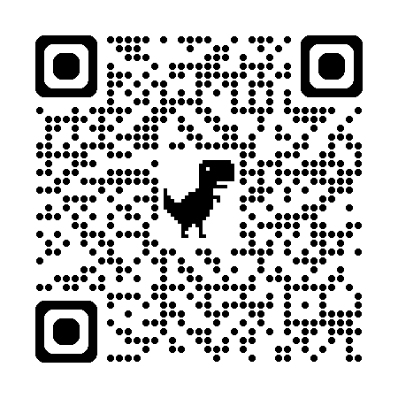

# 🚀 CyberStorm Educational Platform

Welcome to the **CyberSchool Educational Platform**, a full-stack web application designed to provide an interactive and secure learning environment for 👩‍🎓 **students**, 👨‍🏫 **teachers**, and 👪 **parents**. The platform features 🔐 **role-based access** to courses, 📅 **live meetups**, 🧠 an **AI-powered assistant**, and ⚙️ a **comprehensive admin panel** for content management.

🔗 **Live Demo**: [https://www.cyberschool.space](https://www.cyberschool.space)




---

## 🛠️ Tech Stack

- **Frontend**: React (with Vite), Tailwind CSS  
- **Backend**: Node.js, Express.js  
- **Database**: MySQL  
- **AI Integration**: Google Gemini API  
- **Authentication**: JSON Web Tokens (JWT)

---

## 📂 Project Structure

The repository is organized into two main folders:

```
cyberschool/
├── frontend/       # Contains the complete React Vite application
└── backend/        # Contains the Node.js Express server and all related API logic
```

---

## ☁️ Deployment

The application is configured for a standard full-stack deployment:

- **Frontend**: Hosted as a static site on **Vercel**. The `vercel.json` file is included to handle SPA routing.
- **Backend**: Hosted as a web service on **Render**.
- **Database**: Hosted as a managed **MySQL** instance on **Railway**.

🔐 The live application uses environment variables on these platforms to manage production secrets and keys.

---
